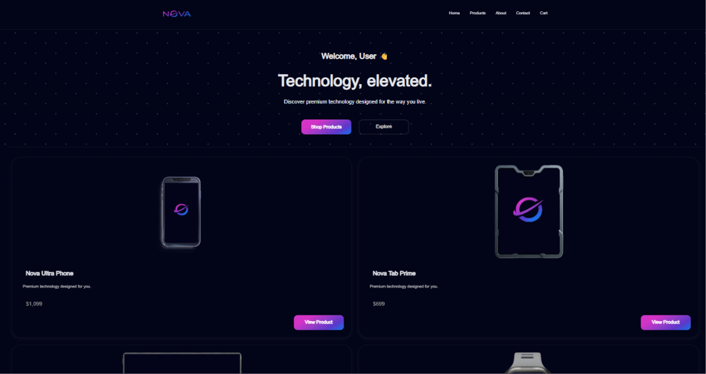

# Nova 2.0

A modern e-commerce frontend rebuilt with **Next.js, React, TypeScript, Tailwind CSS, and daisyUI**.

Nova 2.0 is a complete rebuild of the original Nova E-Commerce project, focusing on a cleaner component-based architecture, responsive design, and a modern frontend development workflow.

## 🌐 Live Demo

[View Live Demo](https://nova-lemon-eta.vercel.app/)

## ✨ Features

* 🔎 Product search
* 🏷️ Product filtering
* 🛒 Add products to cart
* 🗑️ Remove products from cart
* 🔢 Update product quantities
* 💰 Automatic cart total calculation
* 🔐 Login interface with form validation
* ⏳ Loading screen
* 📱 Responsive design across different screen sizes
* 💾 Cart data persistence using localStorage

## 🛠️ Tech Stack

* **Next.js 16**
* **React 19**
* **TypeScript**
* **Tailwind CSS 4**
* **daisyUI 5**
* **Lucide React**
* **ESLint**
* **React Compiler**

## 📄 Pages

* **Home** — Main storefront and featured content
* **Products** — Product browsing, search, and filtering
* **Product Details** — Detailed information for individual products
* **Cart** — Manage products, quantities, and cart total
* **Login** — Login interface with form validation
* **About** — Information about Nova
* **Contact** — Contact page

## 🧩 Project Structure

```text
src/
├── app/
│   ├── (main)/
│   │   ├── about/
│   │   │   └── page.tsx
│   │   ├── cart/
│   │   │   └── page.tsx
│   │   ├── contact/
│   │   │   └── page.tsx
│   │   ├── products/
│   │   │   └── [id]/
│   │   │       └── page.tsx
│   │   └── page.tsx
│   │
│   ├── login/
│   │   └── page.tsx
│   │
│   ├── globals.css
│   └── layout.tsx
│
├── components/
│   ├── Footer.tsx
│   ├── Navbar.tsx
│   ├── ProductCard.tsx
│   └── LoadingScreen.tsx
│
└── data/
    └── products.ts
```

## 🖼️ Screenshots



## 🎯 Project Goal

Nova 2.0 was built as a practical frontend project to apply modern React and Next.js development concepts in a real-world e-commerce interface.

The project also serves as a rebuild of the original Nova E-Commerce project, moving from a traditional **HTML, CSS, and JavaScript** implementation to a modern component-based architecture.

## 👨‍💻 Author

**Ahmed Zaher Abdelmohsen**

Frontend Developer focused on building modern, responsive, and user-friendly web experiences.

* Portfolio: `<portfolio-url>`
* GitHub: `https://github.com/A-H-M-E-D-Z-A-H-E-R`

---

⭐ If you found this project interesting, feel free to explore the repository.
